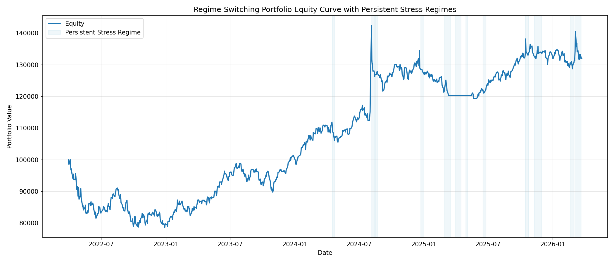

# Regime-Switching Portfolio with Convex Volatility Overlay

## Overview
This project implements a systematic portfolio that dynamically allocates between equity indices (SPY, QQQ) and convex volatility exposure (UVIX) based on market regime detection.

The strategy identifies stress regimes using volatility expansion and convexity indicators, and adjusts portfolio exposure accordingly.

---

## Key Features

- Regime detection using volatility expansion signals
- Dynamic allocation between SPY, QQQ, and UVIX
- Convex payoff profile (captures upside during stress events)
- Transaction cost and turnover modeling
- Volatility targeting and drawdown control
- Walk-forward validation

---

## Results



---

## Strategy Logic

- **Normal regime:** Long SPY + QQQ
- **Stress regime:** Reduce equity exposure and introduce UVIX
- **Objective:** Capture convex returns during volatility spikes

---

## How to Run

```bash
python -m src.regime_portfolio_switch
python -m src.viz_regime_portfolio
